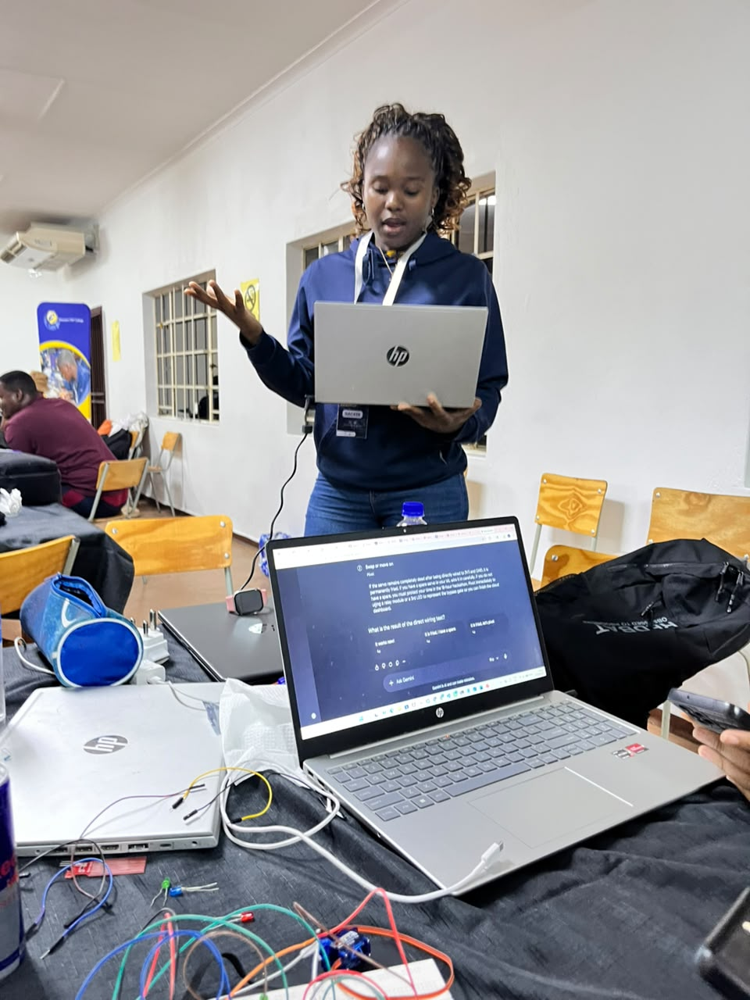
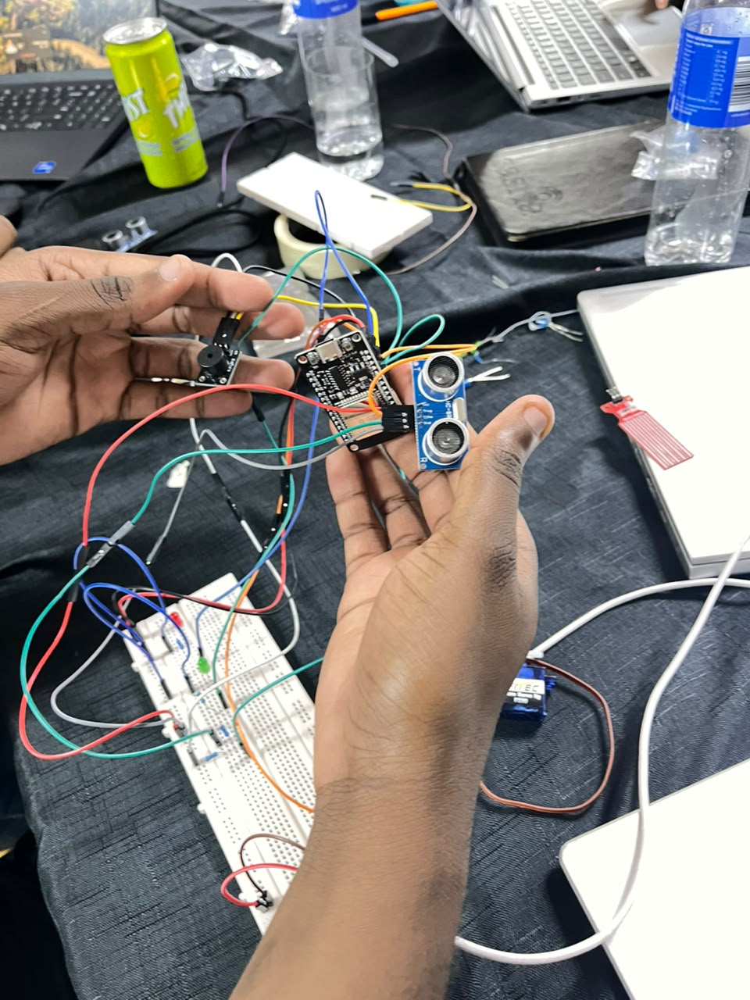
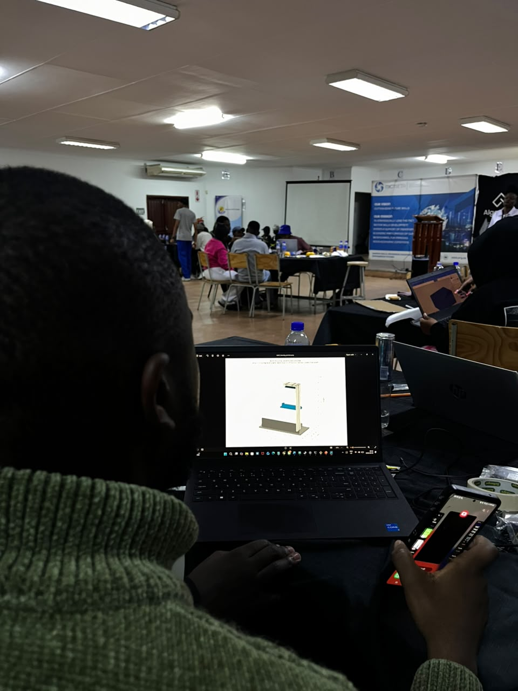

<p align="center">
  
</p>

# AshX - web dashboard and 3D digital twin

AshX is an IoT ash dam safety node. A sensor watches the water level in a dam,
and when the level gets too high, or rises too fast, the device opens a bypass
gate, starts a pump and sounds a siren. All of that logic runs on the device
itself, so it keeps protecting the dam even when the network is down.

This repository is the **dashboard**: a web page that watches the node and draws
a live 3D twin of the physical rig. The hardware is not connected yet, so the
page runs on a **simulator** that models a real tank and runs the real firmware
logic. When the device is ready, one line of config swaps the simulator for live
MQTT telemetry.

The dashboard only watches. It never sends a command to the device.

---

## The team and the build

<table>
  <tr>
    <td width="50%"></td>
    <td width="50%"></td>
  </tr>
  <tr>
    <td align="center"><sub>Walking the team through the wiring plan.</sub></td>
    <td align="center"><sub>The ESP32, HC-SR04, buzzer and servo before they went into the rig.</sub></td>
  </tr>
  <tr>
    <td></td>
    <td></td>
  </tr>
  <tr>
    <td align="center"><sub>Status LEDs and their resistors on the breadboard.</sub></td>
    <td align="center"><sub>Drawing up the 3D printed housing in CAD.</sub></td>
  </tr>
  <tr>
    <td colspan="2"></td>
  </tr>
  <tr>
    <td colspan="2" align="center"><sub>Heads down at the hackathon.</sub></td>
  </tr>
</table>

---

## How to run it

1. Open this folder in VS Code.
2. Install the **Live Server** extension if you do not have it.
3. Right click `index.html` and choose **Open with Live Server**.
4. The page opens at `http://127.0.0.1:5500`.

You need a server because the code uses ES modules. Opening `index.html` as a
`file://` path will not work. Any static server will do, for example:

```
python -m http.server 5500
```

There is no build step, no npm install and no backend. Three.js and Chart.js
come straight from the jsDelivr CDN, so you do need internet access the first
time you load the page.

---

## Using the dashboard

**Scenario buttons** (keyboard 1 to 5) drive the simulated tank:

| # | Scenario | What it shows |
|---|----------|---------------|
| 1 | Calm | Level drifts between 4 and 6 cm. Nothing trips. |
| 2 | Slow overfill | Steady inflow crosses 10 cm, the alert latches, the pump drains the tank, the alert clears below 7 cm. |
| 3 | Rain surge | Fast inflow from a low level. The alert trips on **rate of rise** before the level ever reaches 10 cm. |
| 4 | Drain / recovery | Inflow stops and the level falls back to safe. |
| 5 | Network drop | Telemetry stops for 10 seconds. The banner reads "Device offline, safety logic still running on the edge". The device is still deciding for itself. |

**Manual level override**: drag the slider to force any level from 0 to 15 cm.
This is the quickest way to demonstrate the thresholds on stage. Press
"release to simulation" to hand control back to the simulated inflow.

**The 3D twin**: drag to orbit, scroll to zoom, right drag to pan.

---

## The hardware this twin represents

- **ESP32** dev board on an electronics tray with a breadboard.
- **HC-SR04** ultrasonic sensor on an L bracket arm above a clear container,
  pointing down. It measures the distance to the water surface, so
  `level = TANK_HEIGHT_CM - distance`.
- **FS90 micro servo** swinging a bypass gate between 0 degrees (CLOSED) and
  90 degrees (OPEN), next to a spillway opening.
- **Relay module** switching a small 3V DC pump on its own battery. When the
  pump runs it moves water out of the dam into a catch cup.
- **Buzzer** that sounds during CRITICAL.
- **Green LED** for system OK, **red LED** for the CRITICAL alarm.

Everything in the 3D scene is built from Three.js primitives, so there are no
model files to download. One world unit equals one centimetre, which means the
water box height is literally the level in cm.

---

## The 3D printed housing

The `3d model` folder holds the printable parts for the rig that carries the
sensor over the tank. Every part is a plain STL, so you can drop them straight
into a slicer.

<p align="center">
  
</p>

| File | Part |
|------|------|
| `3d model/AshX_1_base.stl` | base plate the whole rig stands on |
| `3d model/AshX_2_wall.stl` | upright wall that carries the arm |
| `3d model/AshX_3_arm.stl` | arm that holds the HC-SR04 over the water |
| `3d model/AshX_4_plate.stl` | moving level plate the sensor reads against |
| `3d model/AshX_housing_preview.png` | the assembled preview above |

---

## The safety logic (this runs on the ESP32, not here)

```
TANK_HEIGHT_CM      = 15.0
CRITICAL_LEVEL_CM   = 10.0
SAFE_RESET_LEVEL_CM = 7.0
RISE_THRESHOLD_CM   = 3.0
WINDOW              = 10 samples at about 0.5 s each (about 5 seconds)

rise    = level now - level 10 samples ago   (0 until the window fills)
tooHigh = level >= CRITICAL_LEVEL_CM
tooFast = rise  >= RISE_THRESHOLD_CM

if (tooHigh || tooFast)                       alert = true    // latches
else if (alert && level < SAFE_RESET_LEVEL_CM) alert = false   // hysteresis

alert ON  -> gate OPEN,   pump ON,  buzzer ON,  red LED ON,  green LED OFF
alert OFF -> gate CLOSED, pump OFF, buzzer OFF, red LED OFF, green LED ON
```

The firmware also runs a **median of 5** filter over the raw readings and skips
a whole cycle when the sensor gets no echo. The simulator does both of these,
which is why you see the chart stay smooth even though the raw sensor is noisy.

The latch and the hysteresis matter: once the alarm fires it stays on until the
level is genuinely safe again, so the gate does not flap open and closed around
the threshold.

---

## The data contract

The ESP32 will publish one JSON message about once per second. The simulator
emits exactly the same shape, and every part of the UI is driven only by these
fields:

```json
{
  "device": "ashx-01",
  "level": 8.42,
  "rise": 0.31,
  "state": "OK",
  "gate": "CLOSED",
  "pump": "OFF",
  "pct": 56.1,
  "uptime": 128456
}
```

| Field | Meaning |
|-------|---------|
| `device` | node id |
| `level` | water level in cm |
| `rise` | cm risen over the last 5 second window |
| `state` | `OK` or `CRITICAL` |
| `gate` | `OPEN` or `CLOSED` |
| `pump` | `ON` or `OFF` |
| `pct` | level as a percentage of `TANK_HEIGHT_CM` |
| `uptime` | milliseconds since boot |

"Time to critical" is **not** a device field. The browser works it out from
`level` and `rise`, which is why it can say "stable" when the water is not
rising.

---

## Switching to the real device

1. Add the mqtt.js library to `index.html`, just above the module script:

   ```html
   <script src="https://cdn.jsdelivr.net/npm/mqtt@5.3.5/dist/mqtt.min.js"></script>
   ```

2. In `js/config.js`, set your team name and topic:

   ```js
   export const MQTT_CONFIG = {
     url: "wss://broker.hivemq.com:8884/mqtt",
     team: "yourteam",
     topic: "ashx/yourteam/telemetry",
     ...
   };
   ```

3. In `js/config.js`, change one line:

   ```js
   export const DATA_SOURCE = "MQTT";   // was "SIM"
   ```

That is the whole change. `js/data/source.js` picks the class, and because
`MqttSource` and `SimulatedSource` expose the same four methods
(`start`, `stop`, `onReading`, `onConnectionChange`), nothing else in the
project knows or cares which one is running. The scenario buttons hide
themselves automatically, because there is nothing to stage on a real dam.

The ESP32 must publish the JSON above to `ashx/<team>/telemetry`. If a field
ever gets renamed in the firmware, translate it back to the contract inside
`MqttSource`'s message handler, so the rest of the dashboard stays untouched.

---

## What each file does

```
index.html              page structure, importmap for Three.js, Chart.js script tag
style.css               the dark console theme
js/config.js            every constant: thresholds, tank size, colours, MQTT settings
js/main.js              wires the source, the twin, the panel and the chart together
js/data/source.js       picks SIM or MQTT based on config, the single switch
js/data/simulator.js    fake tank + fake sensor + the real firmware logic
js/data/mqtt.js         STUB for the real device, with TODOs where work is left
js/scene/twin.js        the Three.js scene and everything that moves in it
js/ui/panel.js          status cards, level gauge, time to critical, event log
js/ui/chart.js          the live level chart with the two threshold lines
```

Read `js/main.js` first. It is short, and it shows how the other five modules
fit together.

---

## Notes and limitations

- The simulator is not a physics engine. It is a level, an inflow rate and a
  pump outflow rate, which is enough to make the thresholds behave believably.
- Sensor noise, wild spikes and missed echoes are simulated on purpose, so you
  can see the median filter earning its place.
- The rain surge scenario fades its inflow over about 12 seconds, so the pump
  eventually wins and you get to watch the alert clear.
- `uptime` comes from the device. During a network drop the twin dims and the
  banner appears, but the level shown is the last one received, which is exactly
  what a real operator would be looking at.
